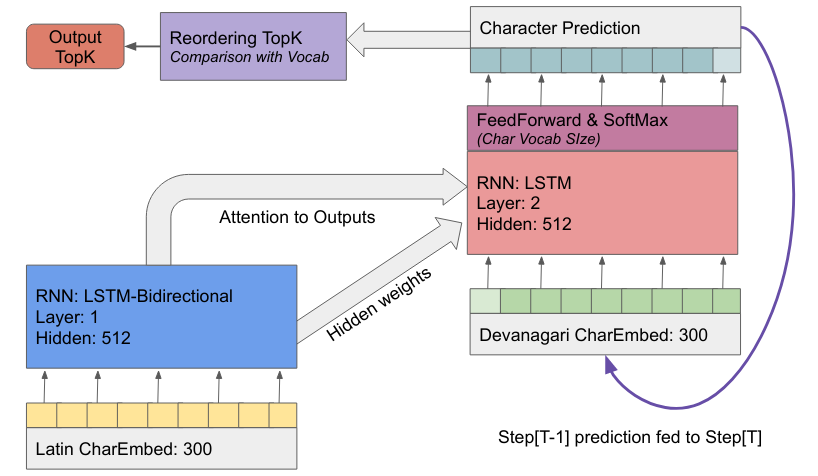

# Architecture

The architecture is based on the Sequence-to-Sequence models constructed with Recurrent neural networks, with encoder-decoder setup, where each character of the word corresponds to time.  

**Encoder**

The encoder (bidirectional LSTM) reads the characters of input word, transforms it into a series of output vectors at each timestep (encoder output vectors) and compressed context vector  representation obtained towards end of sequence(hidden vector).  
The input to encoder is in form of vector(embedding) for each character in the input language. Embeddings are learned during trainig.

**Decoder**

The decoder initally takes the context vector and predicts outputs. At each time step the weighted encoder output vectors (attention mechanism) are also used along with context vector to compute the output sequence. The mechanism makes the decoder to pay attention only to the required information at each time step. 
Similar to encoder, the input to decoder at each timestep is embeddings corresponding to characters in target langauge.  
Output at each time step is probability distribution over the characters of the target langauge (obtained with softmax).

The model is trained jointly to learn all the character_embeddings, encoder_weights, decoder_weights, and attention_weights together.

**Reranking topK**

At the time of inferencing the decoder uses active beam search to obtain K predictions (topk) for each input, based on the joint probability of characters in sequence.  
The list of topk predictions is then reranked (re-ordered) based on the vocabulary of the target language, this bubbles up predictions that are most likely words.

---
### Reference
1. Neural Machine Translation by Jointly Learning to Align and Translate. [arXiv:1409.0473 (cs.CL)](https://arxiv.org/abs/1409.0473)

