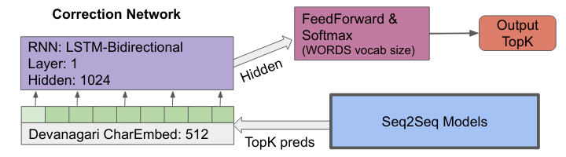

## Vocab Correction Network

The output from seq2seq model (which converts latin script to native script) is
fed into the Corrective model. The corrective model takes character sequence as
input (trained embedding) and performs multinominal classification over the Vocabulary of the target language. The top1 prediction based on probability from softmax layer will approximate to the nearest word. This approach corrects minor glyph errors.  

In order to handle out of vocab words, a seperate class 'UNKNOWN' is used. When
output from correction model points this class,it means the model is not sure on
approximating to exisiting Vocab and the input feed to the model itself is
expected to be retained.

The initial training for model is based on the entire vocabulary (size of output
class), with inputs word with random glyph removal or replacement that corrsposnds to specific word class in output. Some complex lengthier words and randomly generated sequences corresponds to 'UNKNOWN' during training.This enables
model to learn the character level orthography of the language. Then the model is
fine tuned based on the predictions from seq2seq to capture pattern in error made
by seq2seq model.

## Fusion Technique

In this approach an seperate LM-decoder is trained with words from target
language. Model is trained to predict next character in sequence given the
prior characters. LM-decoder learns the orthography of target language and
predicts most likely charaacters at each time step.

This model is then fused with regular trained seq2seq model  (which converts latin script to native script). The fusion could be achieved in two ways.

**Shallow fusion**

The output softmax probabilities (at each time step) from both seq2seq-decoder and LM-decoder is elementwise multiplied to obtain the character prediction.

**Deep fusion**

The hidden layer of both seq2seq-decoder and LM-decoder is concatenated before passing to the output FC layer then softmax applied. Finetuning could be in two ways
1. The output layer alone could be finetuned, freezing all other weights of both decoders
2. The entire decoder block of seq2seq could be finetuned, freezing seq2seq-encoder and LM-decoder.

### Reference
1. On Using Monolingual Corpora in Neural Machine Translation.
[arXiv:1503.03535 (cs.CL)](https://arxiv.org/abs/1503.03535)
2. Cold Fusion: Training Seq2Seq Models Together with Language Models
[arXiv:1708.06426 (cs.CL)](https://arxiv.org/abs/1708.06426)